# 🛒 Green Mart 🌿🥕

A modern supermarket UI application built using Flutter. Green Mart provides a smooth shopping experience where users can browse products, explore categories, search for items, view product details, cart and profile.

---

## 🖼️ Screenshots

###  Intro Screens

<p float="left">
  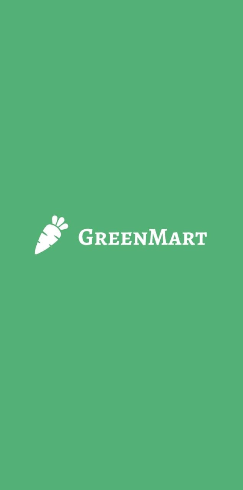
  
</p>


### 🔐 Authentication Screens

<p float="left">
  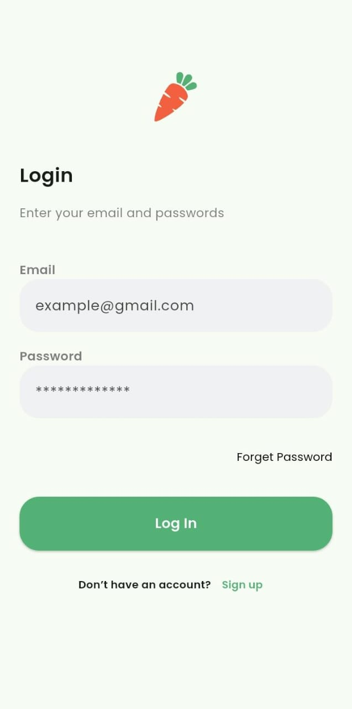
  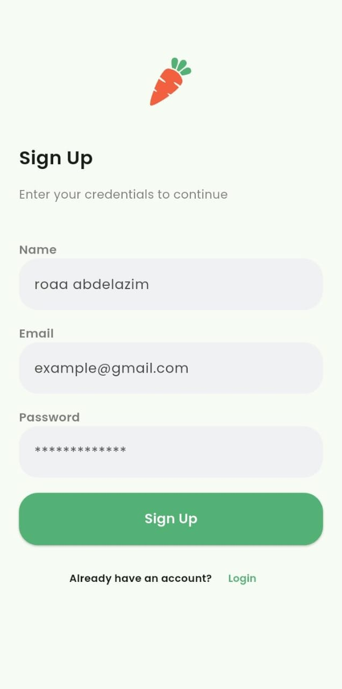
  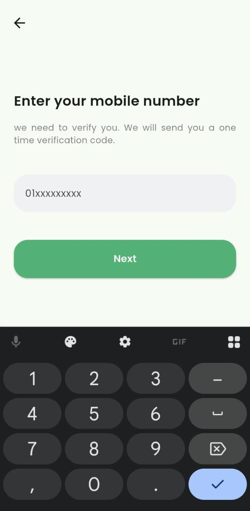
  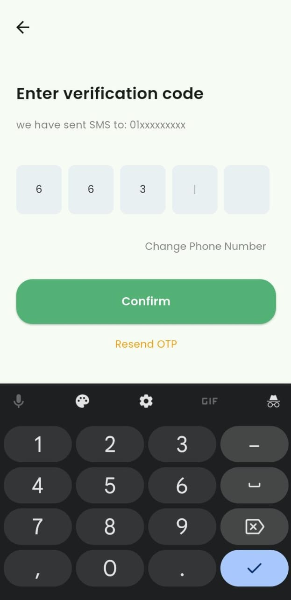
</p>

### 🛍️ Main Screens

<p float="left">
  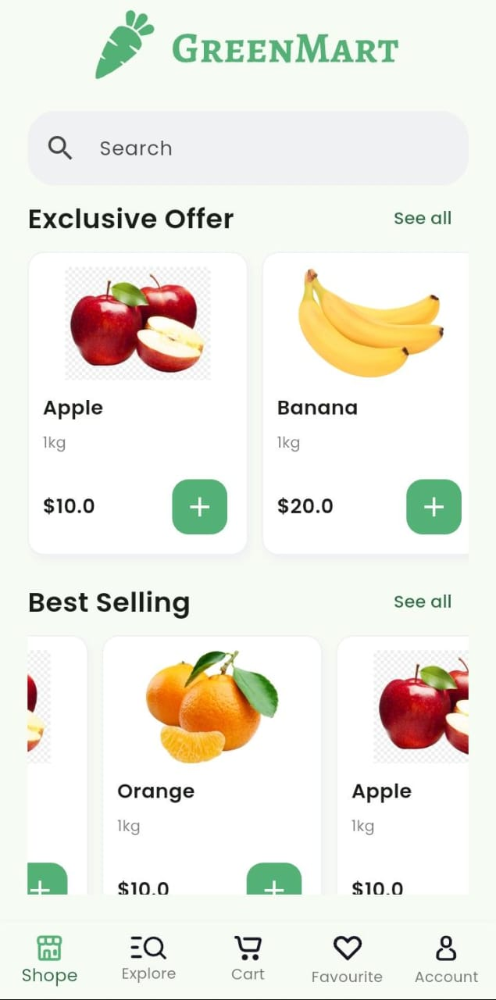
  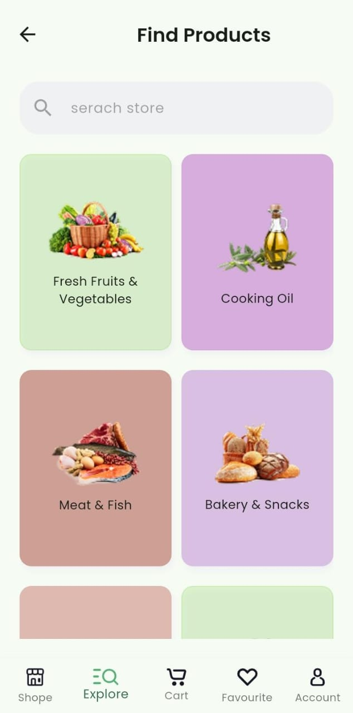
  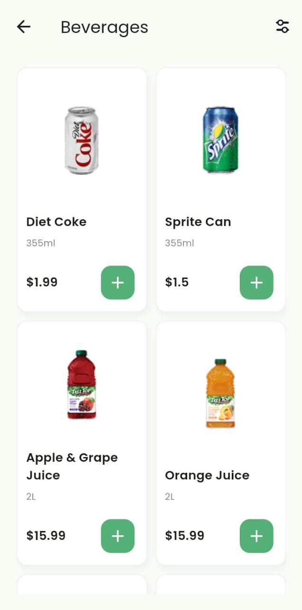
  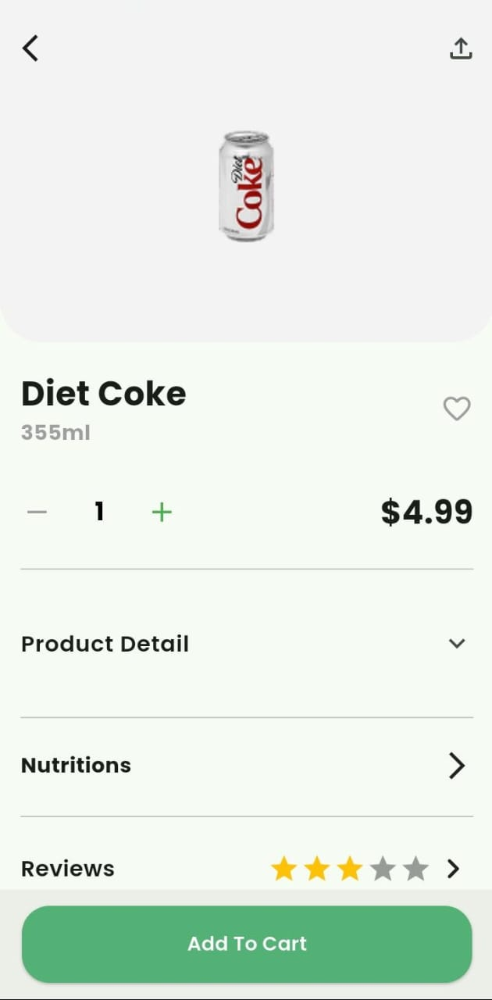
</p>

<br>

<p float="left">
  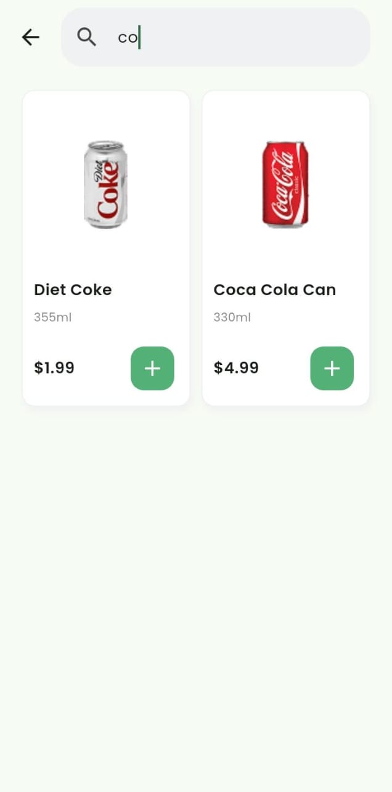
  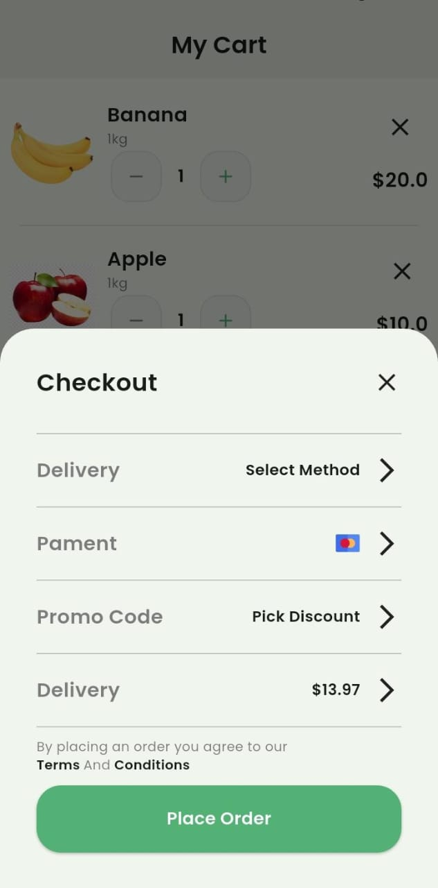
  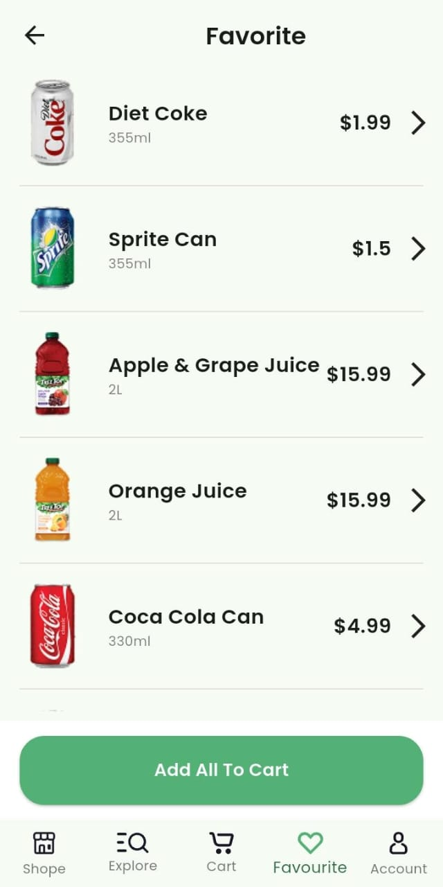
</p>

<br>

<p float="left">
  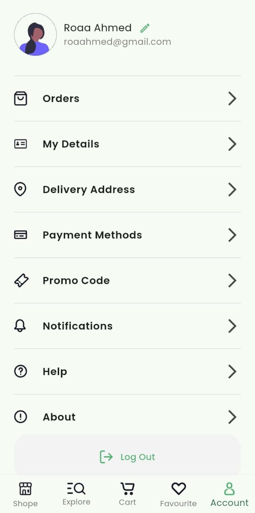
</p>

---

## 🚀 Features

- Modern and clean supermarket UI  
- Splash screen  
- Login / Sign Up UI  
- Browse products  
- Explore categories  
- Product details view  
- Search functionality  
- Add to cart interface  
- Favorites screen  
- Profile screen  

---

## 📱 Technologies Used

- **Flutter**  
- **Dart**  
- Material Design Components  

---

## 📦 Installation

1. **Clone the repository**
   ```bash
   git clone https://github.com/Roaa19/Green_mart
   cd green-mart
